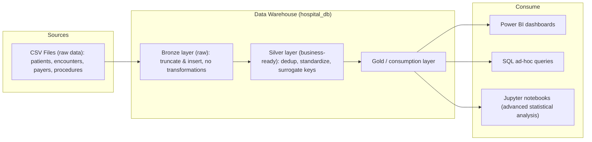

# Massachusetts General Hospital Project

Full data warehousing and analytics project built on SQL Server using the
Medallion (Bronze–Silver–Gold) architecture. This document covers **Phase 1 —
the data warehouse**, which ingests synthetic healthcare CSV data, refines it
into business-ready tables, and exposes it for BI and analytical consumption.

## 1. Project Overview

The Massachusetts General Hospital Project is a data warehousing & analytics
solution for synthetic healthcare records (generated with
[Synthea](https://synthetichealth.github.io/synthea/)). Raw flat files
describing patients, encounters, payers, and procedures are ingested into a SQL
Server database, cleaned and standardized through layered transformations, and
made available for reporting and statistical analysis.

The project is organized into phases:

- **Phase 1 — Data warehouse (done):** the Medallion pipeline documented here
  (CSV sources → Bronze → Silver → Gold/consumption), including the DDL,
  stored procedures, data-quality checks, and transformation logic.
- **Future phases:** analytics and consumption assets (Power BI dashboards,
  SQL ad-hoc analysis, and Jupyter notebooks for advanced statistical work)
  built on top of the warehouse.

## 2. Architecture (Medallion / Bronze–Silver–Gold)

The warehouse follows the Medallion pattern, refining data across successive
layers. This is illustrated in `Data flow diagram.drawio` and
`Data warehouse diagram.drawio`:

- **Sources:** raw CSV files (`patients`, `encounters`, `payers`,
  `procedures`) located under `CSVs/`.
- **Bronze (raw):** tables in the `bronze` schema of `hospital_db`. Loaded via
  batch processing, full load, and truncate & insert, with **no
  transformations** — a faithful copy of the source data.
- **Silver (business-ready):** tables in the `silver` schema. Data is
  deduplicated, standardized, type-cast, enriched with surrogate keys, and
  filtered for referential integrity.
- **Gold / consumption:** the business-ready Silver data is consumed by
  **Power BI dashboards**, **SQL ad-hoc queries**, and **Jupyter notebooks**
  for advanced statistical analysis.



## 3. Database Objects

Defined in `SQL/Creating the data base objects.sql`.

The script (re)creates the `hospital_db` database and two schemas: `bronze`
and `silver`.

**Bronze schema tables** (raw, source-shaped):

- `bronze.payers`
- `bronze.patients`
- `bronze.procedures`
- `bronze.encounters`

Bronze tables mirror the source CSV columns and use natural keys only (e.g.
`Id CHAR(36)`); they have no surrogate keys or constraints.

**Silver schema tables** (business-ready):

- `silver.payers`
- `silver.patients`
- `silver.encounters`
- `silver.procedures`

Each Silver table adds a **surrogate `IDENTITY` primary key** (e.g.
`payer_key`, `patient_key`, `encounter_key`, `procedure_key`) alongside the
original business/natural key, together with standardized column names and
audit timestamps (`UpdatedAt` / `RecordedAt`).

**States lookup table.** `SQL/Creating the states table.sql` creates
`dbo.USStates` (`StateID` identity PK, `StateName`, `Abbreviation`) and seeds
it with the 50 US states and their two-letter abbreviations. This table is used
during the Silver load to standardize state values (see
[Normalization & Standardization](#8-normalization--standardization)).

## 4. Bronze Layer Load

The Bronze load is implemented by the stored procedure `bronze.bulk_load_csv`
in `SQL/procedure_bulk_load_csv.sql`.

Behavior:

- For each source (`encounters`, `patients`, `payers`, `procedures`), the
  procedure **truncates** the target Bronze table, then performs a
  `BULK INSERT` from the corresponding CSV file.
- It is a **batch / full load** using **truncate & insert**, with **no
  transformations** — data lands exactly as it appears in the CSVs.
- `BULK INSERT` options: `FIRSTROW = 2` (skip the header), `FIELDTERMINATOR = ','`,
  and `TABLOCK`.
- The whole batch is wrapped in a `TRY / CATCH` block; on error it prints the
  error message, number, and state.
- Timing `PRINT` statements report per-file load durations and the overall
  batch duration in milliseconds.

```sql
CREATE OR ALTER PROCEDURE bronze.bulk_load_csv AS
BEGIN
    ...
    TRUNCATE TABLE bronze.encounters;
    BULK INSERT bronze.encounters
    FROM "C:\Users\user\...\CSVs\encounters.csv"
    WITH (FIRSTROW = 2, FIELDTERMINATOR = ',', TABLOCK);
    ...
END
```

> Note: the CSV file paths inside the procedure are **hardcoded** to a local
> `C:\Users\user\...` path and must be updated per environment — see
> [How to Run](#10-how-to-run).

## 5. Silver Layer Load & Transformations

The Silver load is implemented by `silver.load_silver` in
`SQL/procedure_load_silver.sql`. It reads from the Bronze tables, applies
transformations, and populates the Silver tables. The whole procedure is
wrapped in `TRY / CATCH` with timing `PRINT`s per step.

Per-table strategy:

- **`silver.payers` — SCD Type 1 (`MERGE`).** Bronze payers are trimmed,
  deduplicated via `ROW_NUMBER() OVER (PARTITION BY Id ...)` (keeping
  `flag = 1`), and joined to `dbo.USStates` to resolve the full state name.
  A `MERGE` performs an in-place update when attributes change (SCD Type 1) and
  inserts new payers.
  - A **"No Payer / Self-Pay" placeholder** row is inserted with
    `payer_key = 0` (via `SET IDENTITY_INSERT`) so encounters without a payer
    can still reference a valid dimension key.
  - Any `PAYER` value present in Bronze encounters but missing from the payers
    table is added as an `Unknown Payer / Auto-Generated` row to preserve
    referential integrity.
- **`silver.patients` — SCD Type 1 (`MERGE`).** Bronze patients are trimmed and
  deduplicated via `ROW_NUMBER()`, then transformed (name concatenation,
  gender/marital decoding, title-casing, `MAIDEN` → bit flag, `COALESCE` to
  `'Unknown'`). A `MERGE` updates changed rows and inserts new patients.
- **`silver.encounters` — incremental insert.** Bronze encounters are
  deduplicated, referential-integrity filtered (see
  [Referential Integrity](#7-referential-integrity)), transformed, and inserted
  only when the `encounter_id` does not already exist
  (`WHERE NOT EXISTS ...`), making the load idempotent/incremental. Encounter
  duration is computed and capped using an IQR-based upper limit.
- **`silver.procedures` — truncate & insert.** Because Bronze procedures have
  no natural unique key, this table is fully refreshed: it is `TRUNCATE`d and
  re-inserted each run. Rows are deduplicated on `(START, PATIENT, CODE)` via
  `ROW_NUMBER()` and referential-integrity filtered. Procedure duration is
  likewise IQR-capped.

## 6. Data Quality Checks

`SQL/Tesing data quality  after bulk insert.sql` contains the profiling and
validation queries run against the Bronze tables after ingestion. They cover:

- **NULL / duplicate checks** on key columns (e.g. confirming no NULL or
  duplicate `Id` values in `encounters`, `patients`, `payers`; confirming
  `PAYER` has no NULLs).
- **Row counts** per table.
- **Date-range checks**, e.g. `MIN`/`MAX` of encounter `START` and patient
  `BIRTHDATE`/`DEATHDATE`.
- **Encounter-length validation** — checking for negative durations and
  inspecting the high side for outliers.
- **Outlier detection** using the **IQR method**
  (`PERCENTILE_CONT` for Q1/Q3, upper limit = `CEILING(Q3 + 1.5 * IQR)`).
- **Categorical profiling** of columns such as `ENCOUNTERCLASS`, `MARITAL`,
  `RACE`, `ETHNICITY`, `GENDER`, `PREFIX`.
- **Code/description cardinality** checks confirming a single `CODE` maps to
  multiple `DESCRIPTION` values (motivating normalization).
- **Referential coverage** checks (e.g. `PAYER` values missing from the payers
  table; procedures whose `ENCOUNTER` is missing from encounters).

The same **IQR-based outlier capping** discovered here is applied in the Silver
load: encounter and procedure durations above the computed upper limit are
capped to that limit, and negative durations are set to `1`.

## 7. Referential Integrity

The Silver load enforces referential integrity by filtering out rows whose
foreign keys do not resolve, before inserting:

- **`silver.encounters`** rows are kept only when:
  - `PATIENT` exists in `silver.patients` (`TRIM(PATIENT) IN (SELECT patient_id FROM silver.patients)`), and
  - `PAYER` (coalesced to the `'0000'` placeholder) exists in `silver.payers`.

  The transformation then joins to `silver.patients` and `silver.payers` to
  replace natural keys with the surrogate `patient_key` / `payer_key`.
- **`silver.procedures`** rows are kept only when:
  - `PATIENT` exists in `silver.patients`, and
  - `ENCOUNTER` exists in `silver.encounters`.

This ordering (payers/patients → encounters → procedures) guarantees that every
Silver fact row references valid dimension/parent rows.

## 8. Normalization & Standardization

Documented in `SQL/Documentation.sql` and implemented in the Silver load:

- **CODE → DESCRIPTION normalization.** In `encounters` and `procedures`, a
  single `CODE` can map to several `DESCRIPTION` values (6 such codes in
  encounters, 4 in procedures). Each code is normalized to the **shortest
  description** (the most general one), chosen via
  `ROW_NUMBER() OVER (PARTITION BY CODE ORDER BY LEN(DESCRIPTION) ASC)`.
- **Text cleanup:** `TRIM` on identifiers/attributes, and **title-casing** for
  values such as `RACE`, `ETHNICITY`, `CITY`, `STATE`, `COUNTY`, and
  `ENCOUNTERCLASS`.
- **Decoding coded values:** `GENDER` (`M`/`F` → `Male`/`Female`),
  `MARITAL` (`S`/`M` → `Single`/`Married`), and `MAIDEN` → bit flag.
- **`COALESCE` to `'Unknown'`** for missing categorical values (e.g. suffix,
  reason codes/descriptions, gender/marital fall back to `'Unknown'`).
- **US state standardization** via the `dbo.USStates` lookup: payer
  `STATE_HEADQUARTERED` abbreviations are joined to `USStates` to populate the
  full `payer_state` name.
- **Deduplication:** `encounters`, `payers`, and `patients` are deduplicated on
  their `Id` column; `procedures`, which lacks a unique identifier, is
  deduplicated on `(START, PATIENT, CODE)` (a patient cannot have the same
  procedure at the same time more than once).

## 9. Orchestration: SQL Server Agent Job, Manual Refresh PowerShell Script, and Desktop Shortcut

> **TODO — not yet committed to the repository.** The artifacts described below
> are part of the intended orchestration design but are **not currently present
> in this repo**. The descriptions are placeholders; the exact contents are not
> documented here to avoid fabrication. When these files are added, replace the
> placeholders with real documentation.

- **SQL Server Agent job (TODO):** a scheduled job intended to run the full
  refresh by executing `EXEC bronze.bulk_load_csv;` followed by
  `EXEC silver.load_silver;` on a defined schedule. *(Job definition not
  committed.)*
- **Manual refresh PowerShell script (`.ps1`) (TODO):** a script intended to
  trigger the same refresh on demand (e.g. via `sqlcmd`/`Invoke-Sqlcmd`).
  *(Script not committed.)*
- **Desktop shortcut (TODO):** a shortcut intended to invoke the PowerShell
  refresh script with a double-click. *(Shortcut file not committed.)*

## 10. How to Run

1. Create the database objects: run `SQL/Creating the data base objects.sql`.
2. Create and seed the states lookup: run `SQL/Creating the states table.sql`.
3. Create the stored procedures: run `SQL/procedure_bulk_load_csv.sql` and
   `SQL/procedure_load_silver.sql`.
4. **Update the CSV paths.** The paths in `bronze.bulk_load_csv` are hardcoded
   to a local `C:\Users\user\...` path and **must be updated to match your
   environment** before running the Bronze load.
5. Execute the pipeline (see `SQL/Testing the stored prosedure.sql`):

   ```sql
   USE hospital_db;
   GO
   EXEC bronze.bulk_load_csv;
   EXEC silver.load_silver;
   ```

6. Validate the results using the queries in
   `SQL/Tesing data quality  after bulk insert.sql`.
